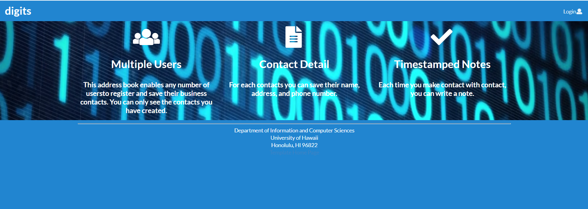
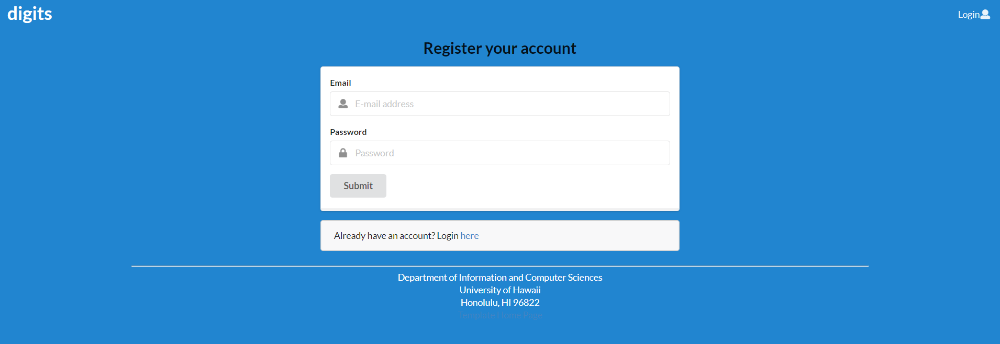
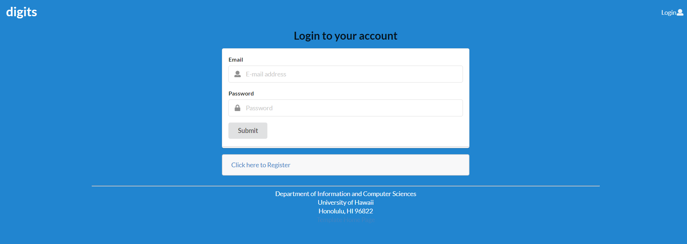
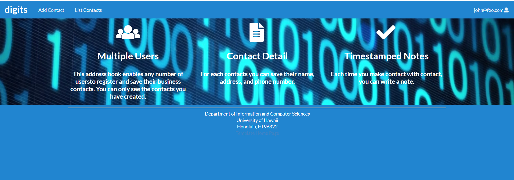
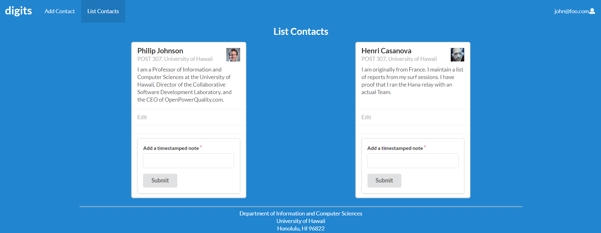
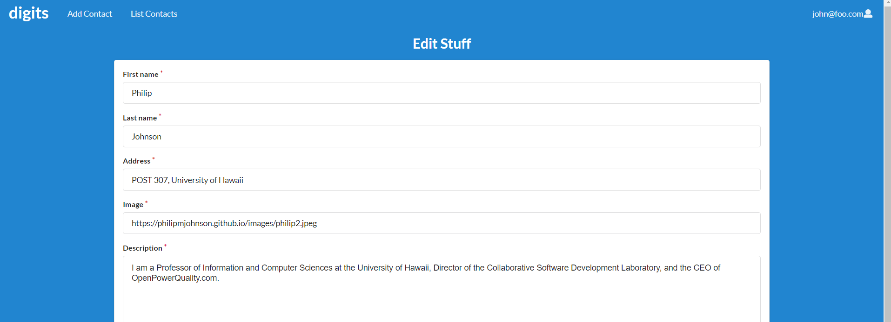

Digits is an app cotains functions to:

  * To registe account.
  * Setup contacts.
  * Add a set of timestamped notes regarding their interactions with each contact.

Examples of the these capabilities will be provided elsewhere.

## Installation

First, install Meteor.

Second, download a copy of Digits. Note that Digits is a private repo and so you will need to request permission from the author to gain access to the repo.

Third, cd into the app/ directory of your local copy of the repo, and install third party libraries with:


```
$ meteor npm install
```

## Running the system

Once the libraries are installed, you can run the application by invoking the "start" script in the [package.json file](https://github.com/ics-software-engineering/meteor-application-template-react/blob/master/app/package.json):

```
$ meteor npm run start
```

The first time you run the app, it will create some default users and data. Here is the output:

```
meteor npm run start

> meteor-application-template-react@ start /Users/philipjohnson/github/ics-software-engineering/meteor-application-template-react/app
> meteor --no-release-check --settings ../config/settings.development.json

[[[[[ ~/github/ics-software-engineering/meteor-application-template-react/app ]]]]]

=> Started proxy.
=> Started MongoDB.
I20180227-13:33:02.716(-10)? Creating the default user(s)
I20180227-13:33:02.742(-10)?   Creating user admin@foo.com.
I20180227-13:33:02.743(-10)?   Creating user john@foo.com.
I20180227-13:33:02.743(-10)? Creating default data.
I20180227-13:33:02.743(-10)?   Adding: Basket (john@foo.com)
I20180227-13:33:02.743(-10)?   Adding: Bicycle (john@foo.com)
I20180227-13:33:02.743(-10)?   Adding: Banana (admin@foo.com)
I20180227-13:33:02.744(-10)?   Adding: Boogie Board (admin@foo.com)
=> Started your app.

=> App running at: http://localhost:3000/
```


### Note regarding "bcrypt warning":

You will also get the following message when you run this application:

```
Note: you are using a pure-JavaScript implementation of bcrypt.
While this implementation will work correctly, it is known to be
approximately three times slower than the native implementation.
In order to use the native implementation instead, run

  meteor npm install --save bcrypt

in the root directory of your application.
```

On some operating systems (particularly Windows), installing bcrypt is much more difficult than implied by the above message. Bcrypt is only used in Meteor for password checking, so the performance implications are negligible until your site has very high traffic. You can safely ignore this warning without any problems during initial stages of development.

### Note regarding "MongoError: not master and slaveOk=false":

Intermittently, you may see the following error message in the console when the system starts up:

```
MongoError: not master and slaveOk=false
     at queryCallback (/Users/philipjohnson/.meteor/packages/npm-mongo/.3.1.1.1mmptof.qcqo++os+web.browser+web.browser.legacy+web.cordova/npm/node_modules/mongodb-core/lib/cursor.js:248:25)
     at /Users/philipjohnson/.meteor/packages/npm-mongo/.3.1.1.1mmptof.qcqo++os+web.browser+web.browser.legacy+web.cordova/npm/node_modules/mongodb-core/lib/connection/pool.js:532:18
     at _combinedTickCallback (internal/process/next_tick.js:131:7)
     at process._tickDomainCallback (internal/process/next_tick.js:218:9)
```

While irritating, this message appears to be harmless and [possibly related to a race condition between the development instance of Mongo and Meteor](https://github.com/meteor/meteor/issues/9026#issuecomment-330850366). By harmless, I mean that in most cases, the console goes on to display `App running at: http://localhost:3000/` and no problems occur during run time.

### Viewing the running app

If all goes well, the template application will appear at [http://localhost:3000](http://localhost:3000).  You can login using the credentials in [settings.development.json](https://github.com/ics-software-engineering/meteor-application-template-react/blob/master/config/settings.development.json), or else register a new account.

### ESLint

You can verify that the code obeys our coding standards by running ESLint over the code in the imports/ directory with:

```
meteor npm run lint
```

## Walkthrough

The following sections describe the major features of this template.

### Directory structure

The top-level directory structure is:

```
app/        # holds the Meteor application sources
config/     # holds configuration files, such as settings.development.json
doc/        # holds developer documentation, user guides, etc.
.gitignore  # don't commit IntelliJ project files, node_modules, and settings.production.json
```

This structure separates documentation files (such as screenshots) and configuration files (such as the settings files) from the actual Meteor application.

The app/ directory has this structure:

```
client/
  main.html      # The boilerplate HTML with a "root" div to be manipulated by React.
  main.js        # import startup files.

imports/
  api/           # Define collections
    stuff/       # The Stuff collection definition
  startup/       # Define code to run when system starts up (client-only, server-only, both)
    client/
    server/
  ui/
    layouts/     # Contains top-level layout (<App> component).
    pages/       # Contains components for each page.
    components/  # Contains page elements, some of which could appear on multiple pages.

node_modules/    # managed by npm

public/          # static assets (like images) can go here.

server/
   main.js       # import the server-side js files.
```

### Import conventions

This system adheres to the Meteor guideline of putting all application code in the imports/ directory, and using client/main.js and server/main.js to import the code appropriate for the client and server in an appropriate order.

### Application functionality

The application implements a simple CRUD application for managing "Stuff", which is a Mongo Collection consisting of a name (String), a quantity (Number), and a condition (one of 'excellent', 'good', 'fair', or 'poor').

By default, each user only sees the Stuff that they have created.  However, the settings file enables you to define default accounts.  If you define a user with the role "admin", then that user gets access to a special page which lists all the Stuff defined by all users.

#### Landing page

When you retrieve the app at http://localhost:3000, this is what should be displayed:


The next step is to use the Login menu to either Login to an existing account or register a new account.


#### Register page

If you do not yet have an account on the system, you can register by clicking on “Login”, then “Sign Up”:



#### Login page

Click on the Login link, then click on the Signin link to bring up the Sign In page which allows you to login:



#### Landing (after Login) page, non-Admin user

Once you log in (either to an existing account or by creating a new one), the navbar changes as follows:



You can now add new Stuff documents, and list the Stuff you have created. Note you cannot see any Stuff created by other users.

#### List Contacts

The List Contacts link brings up a page that lists all of the contacts associated with the logged in user:



This page also allows the user to add timestamped “notes” detailing interactions they’ve had with the Contact. For example:


#### Edit Contacts

From the List Contacts page, the user can click the “Edit” link associated with any Contact to bring up a page that allows that Contact information to be edited:




